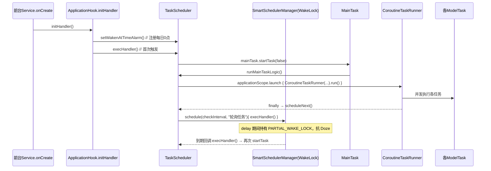
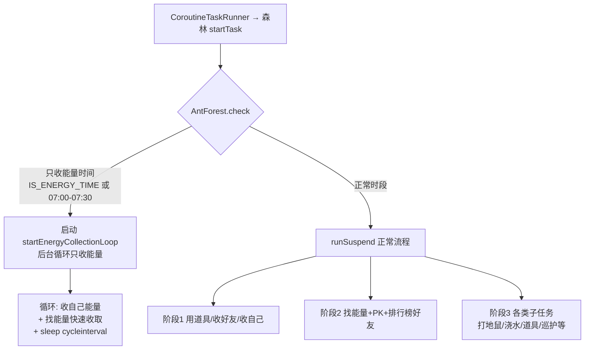
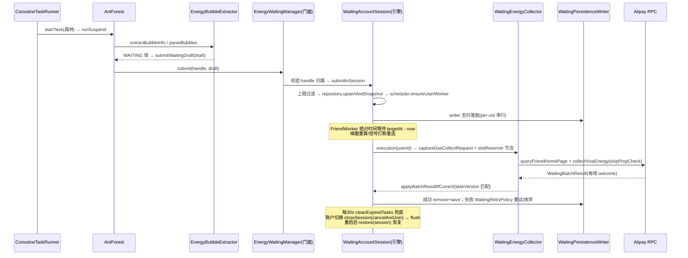

# Sesame-TK 任务执行流程分析

> 本文档基于 `app/src/main/java/fansirsqi/xposed/sesame/` 源码编写，重点剖析**定时任务流程**、**蚂蚁森林（antForest）蹲点流程**以及**其它任务模块的蹲点流程**。
> 已按 antForest 蹲点优化收口方案 V2/V3 落地后的代码更新（引擎已下沉为会话级，能量收取器已拆分为协作类）。
> 所有路径均相对于 `app/src/main/java/fansirsqi/xposed/sesame/`。

---

## 1. 模块总体架构

本项目是一个基于 **LSPosed/Xposed** 注入支付宝进程的 Hook 模块。模块本体是一个独立的 APK（宿主 UI），运行时被注入到 `com.eg.android.AlipayGphone` 进程中，通过 Hook `Application.attach`、`LauncherActivity.onResume`、前台 `Service` 生命周期来驱动任务执行。

### 1.1 核心组件

| 组件                      | 文件                                        | 职责                                                   |
| ----------------------- | ----------------------------------------- | ---------------------------------------------------- |
| `ApplicationHook`       | `hook/ApplicationHook.kt`                 | 模块入口，Hook 目标进程生命周期，初始化调度链                            |
| `TaskScheduler`         | `hook/schedule/TaskScheduler.kt`          | 主任务调度器，负责轮询/定点/0点触发的编排                               |
| `SmartSchedulerManager` | `hook/keepalive/SmartSchedulerManager.kt` | **协程 + WakeLock** 保活调度器（唯一调度引擎）                      |
| `CoroutineTaskRunner`   | `task/TaskRunner.kt`                      | 并发任务执行器，串起所有 `ModelTask`                             |
| `MainTask`              | `task/MainTask.kt`                        | 主任务（wrapper），内部回调 `TaskScheduler.runMainTaskLogic()` |
| `ModelTask`             | `task/ModelTask.kt`                       | 所有任务模块的基类，含协程生命周期与 `ChildModelTask` 子任务机制            |
| `Model`                 | `model/Model.kt`                          | 模型基类，注册表管理                                           |
| `TaskCommon`            | `task/TaskCommon.kt`                      | 全局时间状态（只收能量时间、模块休眠、是否过8点）                            |
| `EnergyWaitingManager`  | `task/antForest/EnergyWaitingManager.kt`  | **蚂蚁森林蹲点管理器门面**（生命周期编排 + 公共 API）                   |
| `WaitingAccountSession` | `task/antForest/waiting/WaitingAccountSession.kt` | **蹲点引擎载体**：repository + scheduler + executor + cleanup 全部下沉到单个会话 |
| `ForestEnergyCollector` | `task/antForest/ForestEnergyCollector.kt` | 蚂蚁森林能量收集**门面**，内部委托给 collector 子组件                   |

> **架构演进要点（V2/V3）**：蚂蚁森林蹲点体系在 V2/V3 落地前是 `EnergyWaitingManager` 单 object 承担 7+ 职责、`ForestEnergyCollector` 单体约 1740 行的紧耦合实现。V2/V3 后：
>
> - 蹲点引擎从进程级单例**下沉为每个账户会话（`WaitingAccountSession`）一个实例**，账户切换时整体丢弃（`rootJob.cancelAndJoin`），消除账户竞态；
> - 能量收集器拆分为 `collector` 包下的多个协作类（见 §1.3）；
> - 蹲点 RPC 改为**类型化 + 请求级 + 每球结果**，替代 `message.contains("网络")` 字符串匹配与全局统计差值猜测。

### 1.2 生命周期链路

```
支付宝进程启动
   │
   ├─ hookApplicationAttach(Application.attach)
   │     └─ 初始化 appContext / Log / SmartSchedulerManager / 验证码 / 滑块模型等
   │
   ├─ hookLauncherResume(LauncherActivity.onResume)
   │     └─ 用户登录检测 → initHandler()（首次/切号时）
   │
   └─ hookServiceLifecycle(前台 Service.onCreate)   ← 支付宝常驻前台服务
         └─ TaskScheduler.mainTask = MainTask("主任务"){ runMainTaskLogic() }
              └─ initHandler()
                    ├─ Model.initAllModel()          // 反射实例化全部 ModelTask
                    ├─ Model.bootAllModel(loader)    // 只 boot 已启用模块（注册 RPC 限频等）
                    ├─ TaskScheduler.setWakenAtTimeAlarm()  // 注册每日 0 点闹钟
                    └─ TaskScheduler.execHandler()   // 首次立即执行一次主任务
```

关键点：

- **双入口**：`hookLauncherResume` 与 `hookServiceLifecycle` 都会尝试 `initHandler()`，由 `@Synchronized` + `init` 标志保证只初始化一次；Service 场景还承担"服务被杀后通过 `onDestroy` → `BroadcastReceiverManager.restartByBroadcast()` 拉起"的保活职责。
- **切换账号**：`hookLauncherResume` 检测到 `targetUid != currentUid` 时重建初始化（`initHandler()` 内部先 `destroyHandler()` 再重来），并触发 `EnergyWaitingManager.onAccountSwitch(oldUid)`。
- **进程约束**：`shouldHookProcess()` 只 Hook 主进程 `com.eg.android.AlipayGphone`，widget 等辅助进程直接跳过。

### 1.3 蚂蚁森林收集器拆分（collector 包）

`ForestEnergyCollector` 现在是门面，具体职责委托给 `task/antForest/collector/` 下的组件：

| 组件 | 职责 |
| --- | --- |
| `EnergyCollectCore` | 收取核心：`collectEnergy` / `collectVivaEnergy`（跳过道具检查） |
| `EnergyBubbleExtractor` | 能量球提取：`parseBubbles`（纯解析）/ `extractBubbleInfo`（含蹲点登记） |
| `WaitingEnergyCollector` | 蹲点收取：批量、请求级、返回每球 `BubbleOutcome` |
| `SelfEnergyCollector` | 立即收取自己能量 |
| `FriendEnergyCollector` | 排行榜好友 + 找能量 + 批量好友处理 |
| `PKEnergyCollector` | PK 好友能量 |
| `WateringBubbleCollector` | 浇水金球 / 回赠 / 复活能量 |
| `RoundCache` | 轮次缓存 |

---

## 2. 定时任务流程（重点）

### 2.1 总体时序



### 2.2 三个触发源

| 触发源        | 注册位置                                                                                                                       | 说明                                                       |
| ---------- | -------------------------------------------------------------------------------------------------------------------------- | -------------------------------------------------------- |
| **首次触发**   | `ApplicationHook.initHandler()` → `TaskScheduler.execHandler()` (ApplicationHook.kt)                                       | 模块初始化完成后立即执行一次                                           |
| **轮询触发**   | `CoroutineTaskRunner.scheduleNext()` → `TaskScheduler.scheduleNextExecutionInternal(lastExecTime)` (TaskRunner.kt:215-222) | 每轮任务跑完后重新调度，形成闭环                                         |
| **每日 0 点** | `TaskScheduler.setWakenAtTimeAlarm()` (TaskScheduler.kt:207)                                                               | 调度到次日 0 点，到点后 `updateDay()` + `execHandler()` + 递归注册次日闹钟 |

### 2.3 调度决策逻辑（scheduleNextExecutionInternal）

`TaskScheduler.scheduleNextExecutionInternal`（TaskScheduler.kt:116）决定下一次何时执行：

```
1. 若 execAtTimeList 含 "-1" → 定时执行关闭，直接返回（不再调度）
2. 默认延迟 = checkInterval（默认 50 分钟）
3. 遍历 execAtTimeList（默认 0010/0030/0100/0700/0730/1200/1230/1700/1730/2000/2030/2359）：
   └─ 若满足 lastCal < execCal < nextCal（即本次窗口内存在定点时刻）
         → 下次执行时间 = 该定点时刻（精确校准）
4. ensureScheduler() → SmartSchedulerManager.schedule(delayMillis, "轮询任务"){ execHandler() }
```

即：**平时按 50 分钟轮询，到定点时刻附近则校准到定点时刻执行**。

### 2.4 SmartSchedulerManager：协程 + WakeLock 调度引擎

`SmartSchedulerManager` 提供两个调度入口：

**`schedule(delayMillis, taskName, block)`**（keepalive/SmartSchedulerManager.kt:76-127）——独立协程调度：

1. 同名任务自动替换（`namedTasks`），防止重复调度堆积。
2. `scope.launch` 启动协程，**先 `acquireWakeLock(delay + 5s)`** 申请 `PARTIAL_WAKE_LOCK`，保证 delay 期间 CPU 活跃、屏幕熄灭也不停摆（解决 Doze 模式下 `Thread.sleep` 时间停滞的问题）。
3. `delay(finalDelay)` → `withContext(Dispatchers.Main){ block() }`（Hook 逻辑在主线程执行）。
4. `finally` 释放 WakeLock 并清理 Map。

**`delayWithWakeLock(delayMillis)`**（keepalive/SmartSchedulerManager.kt:138）——当前协程内带锁延迟（挂起函数）：

1. 由**调用协程自身**完成 delay + WakeLock 保护，**不额外启动协程**。
2. delay 期间持有 `PARTIAL_WAKE_LOCK`（抗 Doze），支持协程取消（`finally` 释放锁）。
3. 用于 `ChildModelTask` 蹲点等待——替代早期"注册空任务借 WakeLock + 自身再 delay"的双协程方案。

> `schedule()` 服务于**轮询任务**、**0 点任务**、**重新登录**等独立调度；`delayWithWakeLock()` 服务于 `ChildModelTask` 蹲点等待（当前协程内直接等待，每个蹲点仅 1 个协程）。

### 2.5 主任务执行链

`runMainTaskLogic`（TaskScheduler.kt:76）中的关键约束：

1. **互斥锁** `TaskLock`：`isTaskRunning` 保证同一时刻只有一轮主任务在跑；重复进入直接抛 `IllegalStateException("任务已在运行中")` 被吞掉。
2. **间隔保护**：距上次执行 < 2 秒则跳过，并 `schedule(checkInterval, "间隔重试")` 延后重试。
3. **账号一致性**：`targetUid != currentUid` → `reOpenApp()`（20 秒后拉起登录页）。
4. **长时间未执行检测**：`checkInactiveTime()`（TaskScheduler.kt:158）——距上次执行超过 1 小时则重新打开 App 前台。
5. 通过后直接启动并发执行器（原 `TaskRunnerAdapter` 已内联）：`ApplicationHook.applicationScope.launch(Dispatchers.Default) { CoroutineTaskRunner(Model.modelArray.filterNotNull()).run() }`。

### 2.6 CoroutineTaskRunner 并发执行模型（task/TaskRunner.kt）

`run()` 流程：

```
run(isFirst, rounds)
 ├─ 互斥检查：ManualTask.isManualRunning（手动任务流运行时跳过本次自动调度）
 ├─ isFirst：ApplicationHook.updateDay() + resetCounters()
 ├─ CustomSettings.loadForTaskRunner() + getOnceDailyStatus()
 ├─ repeat(rounds){ executeRound() }
 │    ├─ 筛选：task.isEnable && !OnceDaily 黑名单
 │    ├─ Semaphore(maxConcurrency=3) 限制并发
 │    ├─ 每个任务 async { executeSingleTask(task) }
 │    └─ awaitAll()
 └─ finally → printExecutionSummary + scheduleNext()
```

`executeSingleTask`（TaskRunner.kt:154-213）的超时策略是**重点**：

| 任务类型                         | 判定                                    | 超时                             | 行为                                                                                 |
| ---------------------------- | ------------------------------------- | ------------------------------ | ---------------------------------------------------------------------------------- |
| **白名单任务**（默认：`森林 / 庄园`） | `timeoutWhitelist.contains(taskName)` | 30 秒启动超时                       | `startTask()` 返回后若 `job.isActive`（已在后台运行）→ 立即视为成功，**不 join**；即使 30s 超时也记为成功（后台继续跑） |
| **普通任务**                     | 其余                                    | `taskDefaultTimeout`（默认 10 分钟） | `job.join()` 等待完成；超时 → 记失败 + `task.stopTask()`                                     |

> 设计意图：森林/庄园是"启动即视为完成"的守护型任务，它们内部自带循环/蹲点调度，不能被外部超时机制打断；普通任务则严格要求在时限内完成，防止卡死主流程。

### 2.7 ModelTask.startTask 内部流程（task/ModelTask.kt:211）

每个任务模块的 `startTask(force, rounds)`：

```
executionMutex.withLock {
  if (isRunning && !force)  → 跳过启动
  if (isRunning && force)   → stopTask() 后重启
  if (!isEnable || !check()) → 跳过（check() 会刷新 TaskCommon 时间状态）
  isRunning = true
  executeMultiRoundTask(rounds)
    └─ for round: executeSequential() → run() → runSuspend()
  finally { isRunning = false }
}
```

`check()`（ModelTask.kt:102-122）的公共拦截规则：

- **只收能量时间**：若蚂蚁森林已启用且当前处于 `IS_ENERGY_TIME`（配置 `energyTime`，默认 `0700-0730`），除森林外的任务全部被拦截——该时段只允许森林收能量。
- **模块休眠**：处于 `modelSleepTime`（默认 `0200-0201`）则所有任务跳过。

---

## 3. antForest 蹲点流程（重点）

蚂蚁森林是整个模块最复杂的任务模块。其蹲点体系独立于通用 `ChildModelTask`，由 `EnergyWaitingManager`（门面）+ `WaitingAccountSession`（会话引擎）专门管理。

### 3.1 执行模式分流



**只收能量模式**（ForestEnergyCollector.kt:94 `startEnergyCollectionLoop`）：

- `AntForest.check()` 发现处于 `IS_ENERGY_TIME || (hour==7 && minute<30)` 时，`GlobalThreadPools.execute{ startEnergyCollectionLoop() }` 起后台循环，并**返回 false** 让主任务跳过正常流程。
- 循环体内反复：`收自己能量` → `quickcollectEnergyByTakeLook()`（快速找能量）→ 睡 `cycleinterval`（默认 5s），直到离开只收能量时段。
- 用 `AtomicBoolean isEnergyLoopRunning` 防止重复启动。

### 3.2 正常流程 runSuspend（AntForest.kt）

按阶段执行（每个阶段用 `TimeCounter` 计时，由 `TaskStep` 列表驱动）：

```
1. checkAndUpdateCounters()：跨天重置计数器/频率限制
2. itemManager 更新道具状态 + 使用自己道具卡（双击卡/保护罩等）
3. 收好友能量：
   ├─ collectEnergyByTakeLook()         // "找能量"接口快速定位有能量好友
   ├─ collectPKEnergyCoroutine()        // PK 好友能量
   ├─ collectEnergy(self)               // 收自己能量（查主页 → extractBubbleInfo → collect）
   └─ collectFriendEnergyCoroutine()    // 排行榜好友并发收取
4. 基于 selfHomeObj 的子任务（按开关逐个执行）：
   打地鼠 → 7天签到 → 浇水金球 → 收道具 → 动物巡护 → 收炸弹卡能量
   → 森林巡护 → 合成动物碎片 → 森林任务领奖 → 绿色行动(≥08:00)
   → 给好友浇水 → 赠送道具 → 活力值兑换 → 能量雨(≥08:10) → 森林集市
   → 绿色医疗 → 青春特权 → 学生签到 → 抽抽乐 → 森林游戏 → 限时乐园
5. finally：记录统计，输出后台蹲点任务数（不等待蹲点完成），清空轮次缓存
```

> 关键设计：**主任务在 finally 立即结束，后台蹲点任务独立于主任务协程继续运行**（"蹲点任务会在后台独立协程中继续运行，不影响其他模块"）。

### 3.3 蹲点任务创建（能量球 WAITING 检测 + 会话提交）

核心入口在 `EnergyBubbleExtractor.extractBubbleInfo()`（collector/EnergyBubbleExtractor.kt:109）→ 经 `parseBubbles()`（:65）纯解析分类：

```
遍历主页 bubbles：
  ├─ collectStatus == AVAILABLE → 加入 availableBubbles（可立即收取）
  └─ collectStatus == WAITING  → 蹲点候选：
       ├─ fullEnergy <= 0 → 跳过
       ├─ 自己账号：需满足收自己能量阈值配置（shouldCollectSelfBubble）
       ├─ produceTime > serverTime（能量球未来成熟）
       ├─ 好友且保护罩覆盖整个成熟期 → shieldManager.shouldSkipWaitingTaskDueToProtection → 跳过
       └─ 通过 → task.submitWaitingDraft(WaitingTaskDraft{...}) → EnergyWaitingManager.submit(handle, draft)
```

**登记链路（V2 生产者句柄机制）**：

- `AntForest.boot` 时调用 `EnergyWaitingManager.registerCallbackCandidate(uid, callback, bindHandle)` 仅登记候选与不可变 UID（AntForest.kt:648）；
- `initHandler` 完整成功后，门面通过 `onInitialized()` 激活候选，创建新的 `WaitingAccountSession` 并回绑 `WaitingProducerHandle`（`bindWaitingHandle`）；
- `AntForest.submitWaitingDraft(draft)`（:700）在 candidate 未激活（handle 为空）时 **fail-closed 安全跳过**；
- 激活后 `EnergyWaitingManager.submit(handle, draft)` 校验 `handle == session.handle`，旧代次 handle 一律拒绝（账户切换 A₁→B→A₂ 后旧 handle 失效）。

### 3.4 蹲点引擎架构（V2/V3 会话级引擎）

#### 3.4.1 门面 EnergyWaitingManager 与生命周期 actor

`EnergyWaitingManager`（object）只承担生命周期编排与公共 API 门面，核心原则：

1. 无保护时：严格按能量球成熟时间收取
2. 有保护时：等到保护结束后立即收取
3. 不提前收取：避免无效请求
4. 精确时机：确保在正确的时间点执行收取

门面持有：
- `lifecycleScope` / `generationCounter` / `producerCounter`；
- `activeSession`（`AtomicReference`）——**进程级只持有一个活跃会话**；
- `callbackCandidate`；
- `persistenceWriter`（进程级 per-uid 串行 writer，flush 可能跨 session 生命周期）；
- `pendingFlushMap`（flush 失败快照，Activate 前重试）。

**生命周期 actor**：`lifecycleActor` 是单 Channel 串行执行队列，所有生命周期命令（账户激活/切换/关闭/广播重启/提交）都投递到其中串行执行，避免 `closeSession` 的 `cancelAndJoin` 与 `submit` 并发：

- `onAccountSwitch(oldUid)` → `switchTo(oldUid)`：ownerUid 校验 → 输出会话指标摘要 → `closeSession` → FlushFailed 阻塞后续 Activate。
- `onServiceDestroy(onComplete)` → 关闭 + flush 后触发 `onComplete`（广播重启调用点移到该回调中）。
- `onInitialized()` → `activateCandidateIfReady()`：**先重试所有 pending flush，全部成功后才创建新 session**。

#### 3.4.2 会话 WaitingAccountSession（引擎载体）

每个账户 generation 一个 `WaitingAccountSession`，承载完整蹲点引擎（V3 引擎下沉）：

- `rootJob`（SupervisorJob）+ 会话级 `scope`；
- `stateMutex`（会话级状态锁）；
- `closing`（AtomicBoolean 关闭标志）；
- `jobs`（`WaitingJobRegistry` 幂等 Job 登记）；
- `repository`（`WaitingTaskRepository`，构造时绑定 ownerUid + generation）；
- `executor` / `scheduler` / `cleanupService`（`lateinit` 解循环依赖，init 块装配）；
- 关闭时整体 `rootJob.cancelAndJoin()` 丢弃，无需手动置空回调。

**提交与持久化（V2 §3.1）**：
- `submitInSession`（EnergyWaitingManager.kt:199）：`stateMutex.withLock` 内仅返回 `MutationPlan`（纯决策），锁外执行持久化 + worker 信号。
- 等待上限过滤：`waitTime > maxWaitTimeMs()` 则 `removeAndSnapshot` 丢弃。`maxWaitTimeMs() = checkInterval × WAIT_TIME_MULTIPLIER(2)`——**原固定 8h 改为随执行间隔动态（默认 50min → 100min）**，靠主任务每轮重新遍历好友登记兜底。
- 去抖持久化：`PersistenceDebouncer`（1s 内多次变更合并一次落盘），经进程级 per-uid 串行 `persistenceWriter`。

#### 3.4.3 单好友调度（WaitingScheduler）

`WaitingScheduler` 核心语义（替代旧的按"成熟时间差 ≤ BATCH_WINDOW"合并组、取组内最晚时间的方案）：

- **每个 `userId` 一个长期 FriendWorker**（经 `WaitingJobRegistry` 幂等启动），同一好友的所有球统一由它调度，不再创建独立 Retry Job；
- **不再主动延迟较早成熟的球**（不合并组、不取最晚）；
- **所有等待基于绝对目标时间**，每次唤醒后重新计算 `targetAt - now`（Doze 晚醒/验证 RPC 耗时自动扣除）；
- 重试表示为任务的 `retryNotBefore/retryCount`，由 FriendWorker 统一等待。

FriendWorker 主循环（WaitingScheduler.kt:79）：

```
while isActive:
  scheduled = repository.tasksOf(userId)
              .map { targetAt = max(calculatePreciseCollectTime(task), task.retryNotBefore) }
              .minByOrNull { targetAt }
  if scheduled == null → 等待信号（空队列不退出，防"新任务已入库但旧worker未完成"）
  awaitTargetOrSignal(scheduled, signal)：
      ├─ 若 repository 已无该 task → return false（重新选目标）
      ├─ remaining = targetAt - clock.nowMillis()；若 <= 0 → 到点执行
      └─ delayController.delayOrSignal(remaining, signal)：被信号打断 → false（重选目标）；完整超时 → true（到点）
  到点 → execution(userId)  // 执行器捕获该好友已熟任务快照
```

> 等待经注入的 `WaitingDelayController`（可信号打断、可虚拟时间测试），时钟走 `WaitingClock`，不再直接 `System.currentTimeMillis()`。

#### 3.4.4 时机计算（WaitingTimingCalculator）

纯决策，不负责等待：

```
calculatePreciseCollectTime(task)：
  主号（isSelf）  → produceTime（能量成熟时刻，不考虑保护罩，到点直接收）
  好友           → maxOf(produceTime, getProtectionEndTime())（保护结束不早于成熟）
```

保护策略冻结为 **SKIP_IF_PROTECTION_COVERS_MATURITY**：登记/验证路径负责跳过被保护覆盖的任务，计算器只返回不早于成熟时间的目标。

#### 3.4.5 执行收取（WaitingExecutor + RpcSlotReserver）

`WaitingExecutor.execute(userId)`（V2 §3.3.5 请求级 + 每球结果）：

```
1. stateMutex.withLock { repository.captureDueCollectRequest(userId, now) }
   // 只纳入 maxOf(produceTime, retryNotBefore) <= now 的任务，构造 token + expected(bubbleId → TaskStamp)
2. if request.expected.isEmpty() → 跳过
3. RPC 节流：slotReserver.reserve() → 短锁内推进 nextAllowedAt，锁外等待返回时长（不持锁等待 delay）
   // RpcSlotReserver 替代旧 AtomicLong get→delay→set 防抖；间隔 500–1500ms，防蚂蚁森林 FREQUENCY
4. 锁外执行 collectFromWaiting(request)（批量回调）→ WaitingBatchResult
5. stateMutex.withLock { applyBatchResultIfCurrent(request, result, executeTime) }
```

**结果应用（applyBatchResultIfCurrent）**——逐球状态转换，只有当前 `taskVersion` 与请求快照匹配才允许修改：

| outcome | 行为 |
| --- | --- |
| `Collected(energy)` | 收取成功，`repository.remove`（不再靠全局统计差值猜测成功） |
| `AlreadyCollected` / `Gone` | 已收取/不存在，移除任务 |
| `StillWaiting(produceTime)` | 仍在等待，更新 `produceTime`（taskVersion+1），唤醒 worker |
| `Empty` | 收取 0 能量，进入重试（`EMPTY_COLLECT`） |
| `Protected(protectionEndTime)` | 保护结束 > 成熟 → 被保护覆盖，移除任务 |
| `Failed(failure)` | 按 `RpcFailureKind` 类型化映射后重试/放弃 |
| 请求级 `RequestFailed` | 对本请求中版本仍匹配的任务统一按类型化失败重试 |

**类型化失败分类**（替代字符串匹配）：

```
RpcFailureKind: OFFLINE / NETWORK / BRIDGE_UNAVAILABLE / EMPTY_RESPONSE /
                FREQUENCY / ALREADY_COLLECTED / AUTH / SERVER_REJECTED / MALFORMED_RESPONSE / UNKNOWN
isRetryable(): NETWORK / FREQUENCY / UNKNOWN → true，其余 → false

WaitingError: NETWORK / FREQUENCY / SHIELD_OR_BOMB / NO_BUBBLE / EMPTY_COLLECT / QUERY_FAILED / UNKNOWN
```

**重试策略（WaitingRetryPolicy）**——单一决策入口：

```
decide(task, error, timeToTarget)：
  retryCount >= maxRetries → GiveUp（移除任务）
  timeToTarget < 10s（仅协程异常路径）→ GiveUp
  不可重试类型（SHIELD_OR_BOMB / NO_BUBBLE / QUERY_FAILED）→ GiveUp
  NETWORK → 5s；FREQUENCY → 10s；EMPTY_COLLECT / UNKNOWN → 5s
  均加 ±2s 随机抖动，retryAt 写入 retryNotBefore，任务带新 retryCount/retryNotBefore 写回仓库
```

#### 3.4.6 蹲点收取回调（WaitingEnergyCollector）

`AntForest` 实现 `EnergyCollectCallback.collectUserEnergyForWaiting(request)`，委托给 `WaitingEnergyCollector`：

```
collectUserEnergyForWaiting(request)
 ├─ rpcGateway.queryFriendHomePage(userId, fromTag)   // 类型化查好友主页
 │    └─ 失败 → WaitingBatchResult.RequestFailed
 ├─ 校验保护：保护罩覆盖 → 逐球 BubbleOutcome.Protected
 ├─ 按 expected 的球逐球分类：StillWaiting / Gone / 可收取（toCollect）
 └─ 调用 core.collectVivaEnergy(..., skipPropCheck=true)   // 快速通道，跳过道具检查
      └─ 组装 WaitingBatchResult.Completed(outcomes, exactCollectedEnergy)
```

`exactCollectedEnergy` 由每球 `Collected` 结果精确求和，不再通过全局统计差值猜测。

#### 3.4.7 兜底清理与恢复（WaitingCleanupService）

`WaitingCleanupService`（session 级，随 `rootJob` 取消）——锁内仅做快速状态操作（filter/启动协程/去抖保存），无 RPC 与 delay：

| 机制         | 说明                                                                                                                              |
| ---------- | ------------------------------------------------------------------------------------------------------------------------------- |
| **定期清理**   | `startPeriodicCleanup()` 每 30s 执行 `cleanExpiredTasks()`：① 唤醒"僵尸任务"（成熟 > `ZOMBIE_THRESHOLD_MS`(2min) 未执行 → `scheduler.start` 重触发）；② 移除真正过期任务（成熟 > `EXPIRE_THRESHOLD_MS`(1h)） |
| **全面重验证**  | `revalidateAllWaitingTasks()`：锁外收集快照 → 逐个 RPC（类型化 `queryFriendHomePage`）验证保护罩 → 锁内批量移除无效任务；主号直接保留 |
| **持久化恢复**  | `restore(session)`（门面内，每个 session 只允许一个 Restore Job）：`awaitIdle(uid)` → 显式 UID 加载 → `DeferredByBackoff` 保守恢复 → 锁外类型化验证 → 锁内 upsert → 规范化快照回写；每次 RPC 前后校验 session，被关闭后不回写 |
| **用户模式统计** | `UserEnergyPatternManager`：每好友 RPC 更新一次用户成功率/响应时间（EMA），仅观测不影响时机 |

### 3.5 蚂蚁森林蹲点完整时序



### 3.6 账户会话边界（V3 收口）

账户切换/退出登录/服务销毁后，旧账户任务**不能继续执行、恢复或写入新账户**：

- **提交 fail-closed**：`submit(task)` 无 handle 或归属（ownerUid/generation）不匹配 → 拒绝；`submit(handle, draft)` 中 handle 非当前会话 → 拒绝。
- **完整 Close barrier**：`closeSession`（EnergyWaitingManager.kt:343）——幂等（activeSession 为 null 返回 `Closed`）→ 摘除 activeSession（新提交立即 fail-closed）→ `rootJob.cancelAndJoin()`（取消 + 等待全部子 Job 退出）→ 最终 flush → `Committed`/`FlushFailed`。
- **FlushFailed 显式暴露**：`CloseResult.FlushFailed` 不报告为成功；失败快照存 `pendingFlushMap`，下次 Activate 前重试成功才允许创建新 session。
- **持久化写入戳**：`WriteStamp(generation, repositoryRevision)` 校验，跨 session 的过期写入被拒绝（StaleSkipped）。

---

## 4. 其它任务模块的蹲点流程

### 4.1 通用机制：ChildModelTask（ModelTask.kt:381）

除蚂蚁森林外，其它模块（庄园、新村等）的"蹲点"统一使用 `ModelTask.addChildTask()` + `ChildModelTask`：

```kotlin
addChildTask(ChildModelTask(taskId, group, runnable/suspendRunnable, execTime))
```

**添加**（`ModelTask.addChildTask`，ModelTask.kt:177）：直接在父任务 `taskScope` 中 `launch(UNDISPATCHED)` 一个执行协程，流程为：取消同 ID 旧任务 → 登记 `childTaskMap` → 记录 `childTask.job = coroutineContext[Job]`（执行协程即子任务协程）→ 执行 `run()` → finally 清理 `childTaskMap`。`UNDISPATCHED` 保证 `addChildTask` 返回后 `hasChildTask()` 立即可见；`remove(key, value)` 使用对象匹配，旧任务取消时不会误删同 key 的新任务。

**执行**（`ChildModelTask.run()`，ModelTask.kt:440）——**每个蹲点仅 1 个协程**（执行协程自身完成等待 + 持锁 + 执行）：

```
1. delayTime = execTime - now
2. delayTime > 0：
   ├─ 进入 waitingTasks 统计（供 UI/日志展示等待数量）
   ├─ useSmartScheduler=true（默认）→ SmartSchedulerManager.delayWithWakeLock(delayTime)
   │     └─ 在当前协程内持 PARTIAL_WAKE_LOCK 地 delay（抗 Doze），不额外启动协程
   ├─ useSmartScheduler=false → 裸 delay(delayTime)（无锁）
   └─ if (!isCancelled) isSuccess = invokeTask()   // 业务异常在 invokeTask 内记录，不向上抛
3. delayTime <= 0：yield() 让出协程（保持异步语义）→ invokeTask()
4. finally：减统计 + 成功或取消时回调 onCompleted(isSuccess)
5. 取消：cancel() → isCancelled = true + job.cancel()（取消执行协程，delay 立即中断）
```

> 协程收敛历程：旧实现每个蹲点占 **3 个协程**（① 借 WakeLock 空任务协程 + ② 嵌套子任务协程 + ③ wrapper 协程）；后合并为 **2 个**（调度协程统一 delay+持锁）；最终收敛为 **1 个**——执行协程自身通过 `SmartSchedulerManager.delayWithWakeLock()` 完成"delay + WakeLock + 执行"，`addChildTask` 不再嵌套额外协程。

> 与蚂蚁森林蹲点的本质区别：
>
> - `ChildModelTask` 是**父任务协程内的轻量定时器**，不持久化，进程重启即丢失；
> - `EnergyWaitingManager` + `WaitingAccountSession` 是**独立于父任务、带持久化/智能重试/保护罩验证/账户会话边界**的完整子系统。

### 4.2 蚂蚁庄园（antFarm）蹲点雇佣小鸡

`AntFarm.kt`（`runSuspend` 的雇佣逻辑中）：

```
遍历 subFarmVO.animals：
  ├─ subAnimalType == "WORK"（正在务工的鸡）
  │    ├─ taskId = "HIRE|" + animalId
  │    ├─ beHiredEndTime（务工到期时刻）
  │    └─ !hasChildTask(taskId) → addChildTask(ChildModelTask("HIRE", { hireAnimal() }, beHiredEndTime))
  │         Log: "添加蹲点雇佣👷在[时间]执行"
  └─ 动物数 < 3 → 立即再雇佣新鸡（走雇佣好友列表）
```

即：每轮主任务巡检时，把"务工中的鸡"注册成到期自动续雇的蹲点任务；到期回调 `hireAnimal()`。

### 4.3 蚂蚁新村（antStall）蹲点请走/收摊

`AntStall.kt`（请走好友与收摊逻辑）：

```
请走：席位被好友占用且未超时
  taskId = "SB|$seatId"
  addChildTask(ChildModelTask("SB", { 若配置allowReject → sendBack() }, endTime))
  Log: "添加蹲点请走⛪在[时间]执行"

收摊：自己的摊 OPEN 且未到 shopTime
  taskId = "SH|$shopId"
  addChildTask(ChildModelTask("SH", {
     若配置autoClose → shopClose()
     sleep 300ms
     若配置autoOpen → openShop()
  }, shopTime))
  Log: "添加蹲点收摊⛪在[时间]执行"
```

### 4.4 其它模块模式总结

对 `antOcean / antOrchard / antSports / antDodo / antCooperate / antMember` 等模块的检查显示：它们均继承 `ModelTask`、重写 `runSuspend()`，主体采用**"轮询式任务"**模式——即每次主任务触发时把当天可做的事一次性做完（用 `delay/sleepCompat` 做请求间隔控制），而非注册定时蹲点。蹲点/定时只在**森林、庄园、新村**三处出现，其中森林的蹲点体系最为完备。

---

## 5. 异常处理与恢复机制汇总

| 机制     | 位置                                                                                        | 说明                         |
| ------ | ----------------------------------------------------------------------------------------- | -------------------------- |
| 任务互斥   | `TaskLock`（TaskScheduler）/ `executionMutex`（ModelTask）/ `stateMutex`（WaitingAccountSession） | 三层互斥防止重复执行/并发写             |
| 超时控制   | `withTimeout`（TaskRunner）/ `taskDefaultTimeout` / 白名单 30s                                 | 防单个任务卡死主流程                 |
| 类型化重试  | `WaitingRetryPolicy`（waiting/WaitingTypes.kt:51）                                          | 按类型化错误（网络/频繁/保护/无球）决策，最多 3 次 + 抖动 |
| RPC 节流  | `RpcSlotReserver`（waiting/WaitingExecutor.kt:177）                                          | 500–1500ms 随机间隔，防 FREQUENCY |
| 僵尸任务唤醒 | `WaitingCleanupService.cleanExpiredTasks` 每 30s                                             | 成熟超 2 分钟未执行 → 重触发          |
| 进程重启恢复 | `EnergyWaitingManager.restore(session)`（显式 UID + DeferredByBackoff）                         | 进程级 per-uid 串行持久化 + 会话恢复 |
| 账户切换隔离 | `closeSession`（cancelAndJoin + 最终 flush）+ 提交 fail-closed + WriteStamp 写入戳               | 旧账户任务不污染新账户               |
| 后台保活   | WakeLock（SmartSchedulerManager / ChildModelTask）+ 前台服务重建广播                                | 抗 Doze 时间冻结                |
| 异常等待   | `RuntimeInfo.ForestPauseTime`（AntForest.check）                                            | 森林异常后暂停 N 分钟再试             |

## 6. 关键配置速查（model/SesameConfig.kt）

| 配置                       | 默认值                                                         | 影响            |
| ------------------------ | ----------------------------------------------------------- | ------------- |
| `checkInterval`          | 50 分钟                                                       | 轮询间隔          |
| `execAtTimeList`         | 0010/0030/0100/0700/0730/1200/1230/1700/1730/2000/2030/2359 | 定点执行时刻        |
| `energyTime`             | 0700-0730                                                   | 只收能量时段（森林优先）  |
| `modelSleepTime`         | 0200-0201                                                   | 模块休眠时段        |
| `taskExecutionRounds`    | 1                                                           | 每轮主任务内任务执行轮数  |
| `taskMaxConcurrency`     | 3                                                           | 并发任务数上限       |
| `taskDefaultTimeout`     | 10 分钟                                                       | 普通任务超时        |
| `taskTimeoutWhitelist`   | 森林/庄园                                                    | 启动即视为完成的长运行任务 |
| `forest.collectInterval` | 50-10000ms                                                  | 收取间隔          |
| `forest.cycleinterval`   | 5000ms                                                      | 只收能量循环间隔      |

---

## 7. 蚂蚁森林蹲点内部调优常量（EnergyWaitingManager.kt）

| 常量 | 值 | 说明 |
| --- | --- | --- |
| `WAIT_TIME_MULTIPLIER` | 2 | 登记上限 = 执行间隔 × 倍数（默认 50min → 100min，替代原固定 8h） |
| `MAX_TASK_AGE_MULTIPLIER` | 2 | 持久化侧保存时间上限倍数 |
| `BASE_CHECK_INTERVAL_MS` | 30s | 定期清理 / 轮询粒度 |
| `ZOMBIE_THRESHOLD_MS` | 2min | 成熟 2 分钟未执行视为僵尸任务，清理时重触发 |
| `EXPIRE_THRESHOLD_MS` | 1h | 成熟 1 小时视为过期，清理时移除 |

---

*本文档由源码静态分析生成，用于理解模块任务执行骨架，不构成对具体业务接口行为的承诺。*
